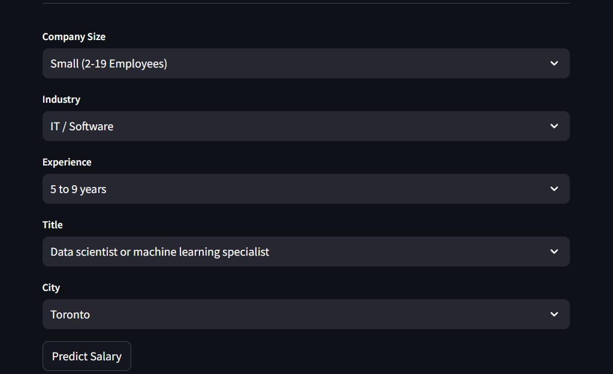

# Canadian Tech Industry Salary Dashboard and Prediction App

This project involves the analysis and prediction of salaries in the Canadian tech industry using data from the Stack Overflow Survey available on [Kaggle](https://www.kaggle.com/datasets/moun12345/canadian-salary-data-from-stack-overflow-survey/code). It includes two main components:

## Project Components

### 1. Power BI Dashboard
 A comprehensive dashboard that provides insights into salary distributions, trends, and other key metrics within the Canadian tech industry.
 
- **Features**:
  - Salary trends across different roles in the last 5 years.
  - Insights into industry-wise salary trends.
  - Analysis of the impact of company size on salaries.
    


[**View Dashboard**](https://project.novypro.com/7aeO55)

### 2. Machine Learning Prediction App
A web application developed using Streamlit that predicts salaries for various tech roles based on user inputs such as company size, industry, experience, title, and location.

- **Model**: The machine learning model(CatBoost Regressor) used in the app was trained on the recent 5-year data in the dataset.
- **Web App**: The app allows users to input details like company size, industry etc to receive a salary estimate.
- **Deployment**: The app is deployed using Streamlit.



[View ML App](https://canadian-tech-job-salary-prediction-and-analysis-hwi24aoawtwoi.streamlit.app/)

## Installation

To run the prediction app locally, follow these steps:

1. Clone the repository:
   ```bash
   git clone https://github.com/your-username/canadian-tech-salary-prediction.git
   cd canadian-tech-salary-prediction
   ```

2. Create and activate a virtual environment:
   ```bash
   python -m venv .venv
   .\.venv\Scripts\activate  # On Windows
   source .venv/bin/activate  # On macOS/Linux
   ```

3. Install the required packages:
   ```
   pip install -r requirements.txt
   ```

4. Run the Streamlit app:
   ```
   streamlit run app.py
   ```


## Notes

- The estimated salary provided by the app is an approximation and is intended for informational purposes only. The underlying data may not be adequate for real-world applicability.
- The app is designed with a focus on Canadian tech roles and may not accurately predict salaries outside of this context.


